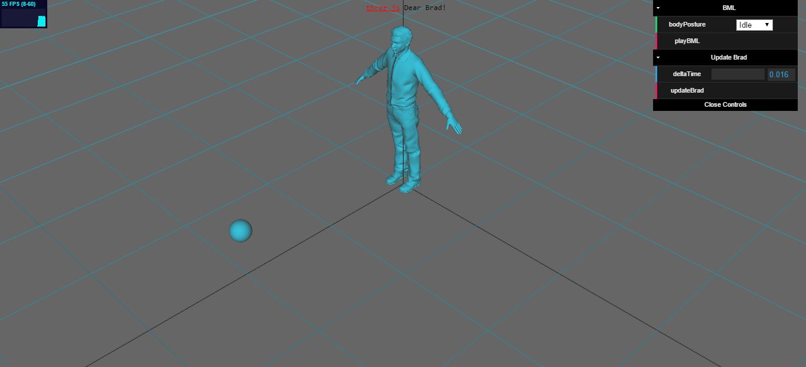

# Integrating SmartBody with threeJS
This project suggests one way of rendering a [SmartBody](http://smartbody.ict.usc.edu/) scene using ThreeJS. Currently, a normal threeJS scene is initialized and connected to a Python backend using WebSocket. The Python backend in turn is managing a SmartBody scene and handling WebSocket requests.

# Dependencies
The following libraries are needed before running the project:

  * Python (2.7.9)
  * [SmartBody (Win32 r5919)](http://sourceforge.net/projects/smartbody/files/SmartBody-r5919-windows.exe/download)
  * Flask-SocketIO (0.6.0)
  * pyzmq (14.5.0)
  * msgpack-python (0.4.6)

# Running

First make sure `SMARTBODYDIR` variable is set to where SmartBody is installed. It is used by brad_scene.py to locate default SmartBody data (skeletons, motions, scripts .. etc)

```
> SET SMARTBODYDIR=C:\SmartBody-r5919
```

Then also following SmartBody installation with Python guidelines  make sure the following run without getting errors:

```
> python -c "import SmartBody;s=SmartBody.getScene()"
```

Then simply run the following:

```
> python brad_socketio.py
Initialize SceneRouterTask...
Polling for connections...
Initialize SbSceneWorkerTask...
media path = C:\SmartBody-r5919/data
Loaded motions: 39
Loaded skeletons: 2
SB: BML idle ...
SB: num of pawns in the scene = 1
SB: num of characters in the scene = 1
Initialized!
Worker-1: Send READY
Polling for connections...
 * Running on http://127.0.0.1:5050/
```

Then browse to `http://localhost:5050/` and get brad in a scene with a sphere like the following:



To stop the server, use `Ctrl+BREAK` on Windows (`Ctrl+C` isn't working yet!)

# Appendix: How we installed SmartBody r5919 on Windows 7

  * Download [SmartBody (Win32 r5919)](http://sourceforge.net/projects/smartbody/files/SmartBody-r5919-windows.exe/download)
  * Installed to `C:\SmartBody-r5919`
  * Copy all the .dll files from `C:\SmartBody-r5919\bin` to `<python_lib_dir>` (e.g. `C:\Python27\Lib\site-packages`)
  * Rename `SmartBody.dll` to `SmartBody.pyd`
  * Add `smartbody.pth` file that contains one-line `SmartBody`
  * After that, the following command should work without errors.:

```
python -c "import SmartBody;s=SmartBody.getScene();"
```

Good Luck!

# Contributors
Mohamed Abdrab, Henri Rönkkö, Junjie Zhou, Henri Tuomivaara

Good luck!
